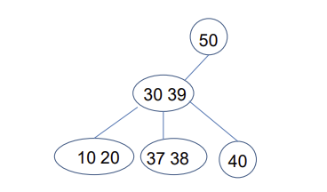
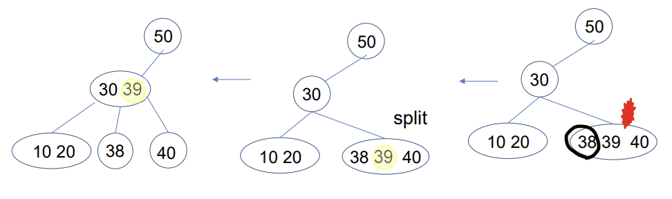
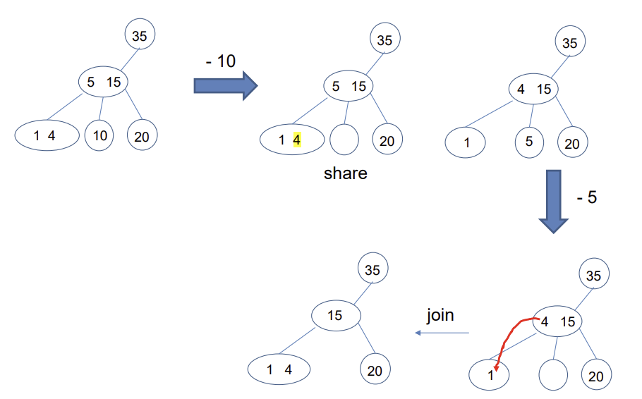
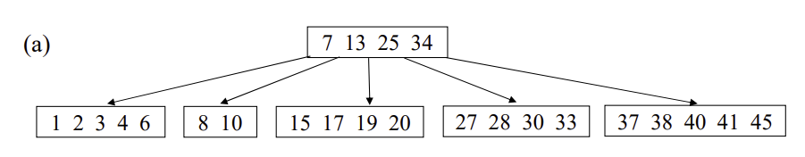

### 3.1 2-3트리

**3.1.1 정의**

1. 완전 균형 트리(Completely Balanced Tree)
   - 완전한 균형을 유지하기 때문에, root에서 leaf에 이르는 모든 경로의 길이가 완전히 동일함
2. 이진트리와는 달리 자식노드를 두개만 가질 수 있는 2노드 형태뿐만 아니라 자식을 3개 가질 수 있는 3노드 형태도 가능함.
   - 3노드 형태의 key값은 2개임.
   - 왼쪽 자식/중간 자식/오른쪽 자식이 존재하며, 왼쪽 자식은 작은 값, 중간 자식은 사잇값, 오른쪽 자식은 큰 값을 가진다.

**3.1.2 Insertion(삽입): split**

삽입을 통해서 노드 안에 key가 세개가 된다면 중앙값을 위로 올리고 3노드를 2노드로 분리한다.

**3.1.3 Deletion: share(형제 노드에 여유가 있는 경우), join(여유있는 형제 노드가 없는 경우)**

삭제 후 형제 트리에 공간이 있을 경우 share하여 값을 옮긴다. 이때 트리의 조건에 맞추기 위해서 부모의 원소를 내리고 자식 원소를 올린다.

join은 부모 원소를 자식 노드에 옮겨서 빈자리를 매꾸는 방식이다.

---

### 3.2 B트리

**3.2.1 정의**

- B-트리는 균형잡힌 다진검색트리로 다음의 성질을 만족한다

  - 루트를 제외한 모든 노드는 k/2 ~ k 개의 키를 갖는다
  - 모든 리프 노드는 같은 깊이를 가진다

- B-트리의 노드 구조
  
- B-트리의 삽입 삭제시에, 2-3트리와 비슷하게 split과 join을 한다.

**3.2.2 Insertion(삽입)**

![[b트리삽입1.png]](imgs/b트리삽입1.png)
오버플로우가 발생하면 형제노드를 살펴보고 형제노드가 포화상태가 아니라면 형제 노드에 원래 노드의 최댓값 or 최솟값을 넘겨준다. 그 다음 형제 노드의 최댓값 or 최솟값을 부모 노드 최댓값 or 최솟값과 바꾼다.

![[b트리삽입2.png]](imgs/b트리삽입2.png)
위 그림에서는 39를 삽입하자 오버플로우가 발생하고 형제 노드도 포화 상태임을 알 수 있다. 이때 split을 하고 중앙값을 부모 노드로 올린다.

![[b트리삽입3.png]](imgs/b트리삽입3.png)
위 그림을 보면 32를 삽입하고 오버플로우가 나서 split 후에 부모 노드로 중앙값을 올렸지만, 부모노드도 오버플로우가 난 것을 알 수 있다. 부모 노드의 형제노드가 없으므로 이때 부모노드를 split하면 된다.

---

### 3.3 레드블랙트리

**3.3.1 정의**

- Red와 Black의 색상을 이용해서 트리의 균형을 유지
- 다음과 같은 조건을 만족해야함.
  1.  루트는 블랙이다.
  2.  모든 리프는 블랙이다.
  3.  노드가 레드이면 그 노드의 자식은 반드시 블랙이다.
  4.  루트 노드에서 임의의 리프 노드에 이르는 경로에서 만나는 블랙 노드의 수는 모두 같다.

![[레드블랙트리예제.png]](imgs/레드블랙트리예제.png)

바로 위와 같이 생긴 트리가 레드블랙트리의 조건을 만족한다. 여기서 리프 노드가 빨간색인데 어떻게 만족하는지에 대한 의문을 가질 수도 있다.

자식이 없는 모든 노드는 NIL(블랙) 노드를 자식으로 가지기 때문에 사실상, 2번 조건은 무시해도 된다.

**3.3.2 삽입**

삽입의 경우 여러가지 경우가 있다. 우선, 삽입할 노드 x(레드)의 부모 노드 p가 블랙이라면 아무런 문제가 없다.

두번째 경우로 삽입할 노드 x(레드)의 부모 노드 p가 레드라면 또 여러가지를 고려해야한다. 첫번째 경우는 아래 그림과 같다.
![[레드블랙트리삽입1.png]](imgs/레드블랙트리삽입1.png)

이때는 바로 저 흰색 부분의 색깔에 의해서 경우가 나누어진다. 흰색 부분을 s라고 할때, 흰색 노드가 레드라면 LLr 조건이다.

LLr 조건을 설명하자면, p의 부모노드를 pp라고 할 때, pp로부터 왼쪽 노드, 그리고 그 왼쪽 노드로 삽입되었을 경우 LL 이고, pp의 오른쪽 자식이 레드일경우 r, 블랙일 경우 b이다.

따라서 x가 p의 오른쪽 자식으로 들어왔다면 LRr이 될 수 있음을 유추할 수 있다. 그리고 p가 pp의 오른쪽 자식이고 또 p의 오른쪽 자식으로 노드 x를 삽입했을 경우 RR임을 알 수 있다.

이렇게 앞에 두 대문자가 방향을 표시하고 뒤에 소문자가 삽입 노드의 부모 노드의 형제 색을 표시한다. 이 부모의 형제 노드에 의해서 CASE가 나누어지고, LL이든 RR이든 반대로 회전만 하면 되므로 설명은 한 번만 하겠다.

s가 레드일 경우 그냥 색만 바꾸면 된다. p와 s를 블랙, pp를 레드로 바꾸면 된다.
![[레드블랙트리삽입2.png]](imgs/레드블랙트리삽입2.png)

s가 블랙일 경우는 [AVL 트리(3.3)](https://github.com/1Dohyeon/Study-DataStructure/tree/master/03_Tree_with_java)처럼 회전을 시킨 후 색을 바꾸면 된다.
![[Pasted image 20240124141917.png]]
색을 바꾸는데에는 상수시간, 색을 바꿔야할 곳까지 탐색하는 것은 트리의 높이에 비례함을 알 수 있다. 따라서 위 알고리즘의 시간복잡도는 log2N 임을 알 수 있다.
